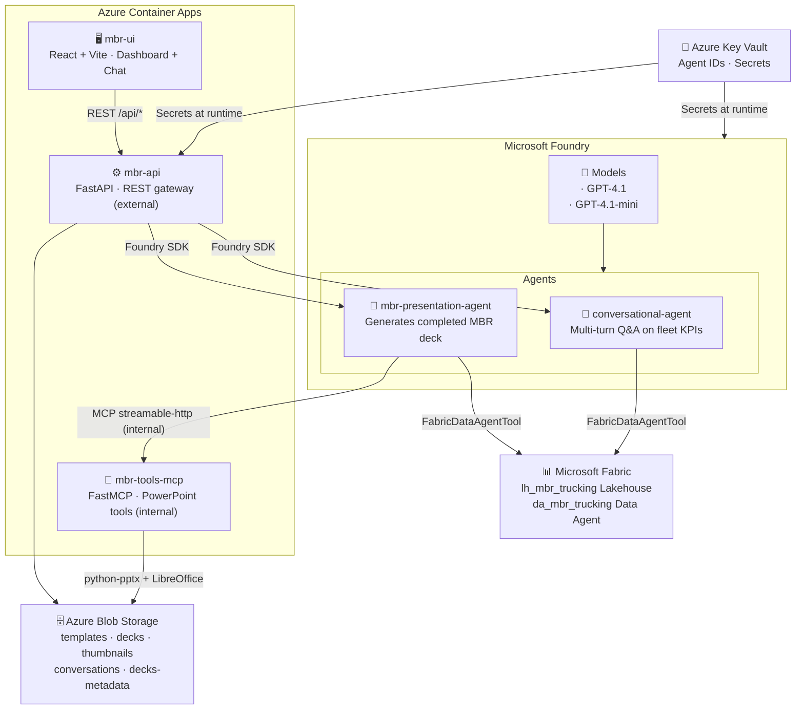

# MBR AI Agents with Microsoft Fabric and Foundry
### End-to-End Example: Conversational KPI Analysis and Automated Presentation Generation

This project demonstrates how to build an **AI-powered Monthly Business Review (MBR) platform** using Microsoft Fabric Data Agents, Microsoft Foundry, and Azure Container Apps — where conversational agents answer questions about live operational data and a presentation agent generates a completed PowerPoint deck on demand.

> Fabric Lakehouse → **Conversational Agent** answers questions about operational KPIs → **Presentation Agent** generates a completed PowerPoint MBR deck

---

## Contents

- [Start Here](#start-here)
- [What It Demonstrates](#what-it-demonstrates)
- [Architecture](#architecture)
- [Project Structure](#project-structure)
- [Deployment](#deployment)
- [Post-Deployment: Manual Fabric Steps](#post-deployment-manual-fabric-steps)
- [Configuration](#configuration)
- [Security Model](#security-model)
- [GitHub Actions](#github-actions)
- [Clean Up](#clean-up)

---

## Start Here

If you're exploring:

- How to connect **Microsoft Fabric Lakehouse** data to **AI Foundry agents**
- How to use the **Fabric Data Agent** as a natural-language interface to structured data
- How to automate **PowerPoint report generation** from live data using MCP tools and agents
- How to build a **full-stack AI platform** on Azure Container Apps with managed identity

→ this project provides a complete, working reference implementation.

The example scenario is **LONGHAUL** — a fictional long-haul trucking company with 13 months of operational KPI data across 5 regions and 20 vehicle types. The trucking domain is interchangeable; the pattern is what matters.

---

## What It Demonstrates

### Pattern 1 — Fabric Data Agent as an AI data interface

Rather than writing SQL in agent prompts or hardcoding queries, this project uses the **Fabric Data Agent** as a dedicated natural-language interface to the Lakehouse. Foundry agents call it like a tool — asking questions in plain English and receiving structured answers drawn directly from live data. No SQL knowledge required by the agent.

### Pattern 2 — Agent-driven report generation via MCP

The **MBR Presentation Agent** orchestrates a two-step workflow: retrieve KPIs from the Fabric Data Agent, then call an MCP tool (`fill_mbr_template`) that fills a PowerPoint template with `python-pptx`, uploads the completed deck to Azure Blob Storage, and returns a download URL. The agent drives the entire flow.

### Pattern 3 — Conversational analytics with thread persistence

The **Conversational Agent** maintains multi-turn threads, allowing users to ask follow-up questions about performance trends, regional comparisons, and cost drivers — all grounded in live Fabric data rather than static context.

### Adapt this to your domain

The LONGHAUL trucking scenario is interchangeable. The same pattern applies to:

- **Retail** → monthly sales performance, inventory KPIs, regional breakdown
- **Healthcare** → operational metrics, patient outcomes, cost-per-procedure
- **Financial services** → portfolio performance, risk metrics, client reporting
- **Manufacturing** → production efficiency, downtime analysis, quality metrics

To adapt: replace the Fabric Lakehouse tables with your domain data, update the Fabric Data Agent and Foundry agent system prompts, and swap in your PowerPoint template.

---

## Architecture



### Core Components

| Component | Technology | Role |
|---|---|---|
| **conversational-agent** | Microsoft Foundry Agent | Multi-turn Q&A against Fabric KPI data |
| **mbr-presentation-agent** | Microsoft Foundry Agent | Orchestrates KPI retrieval and deck generation |
| **da_mbr_trucking** | Fabric Data Agent | Natural-language interface to the Lakehouse |
| **lh_mbr_trucking** | Microsoft Fabric Lakehouse | 13 months of trucking operational KPI data |
| **mbr-api** | FastAPI, Python | REST gateway — routes UI requests to agents and Storage |
| **mbr-tools-mcp** | FastMCP, Python | MCP server — PowerPoint template filling, deck management |
| **mbr-ui** | React, Vite | Dashboard, KPI bar, conversational chat, MBR library |

---

## Project Structure

<details>
<summary>Expand to view repository layout</summary>

```
Azure-Fabric-MBR-AI-Agents/
├── deploy.ps1                          # Full end-to-end deployment orchestrator
├── README.md                           # This file
│
├── agents/                             # Foundry agent definitions + deployer
│   ├── deploy.py                       # Creates / updates both agents, writes IDs to Key Vault
│   ├── conversational_agent.py         # Conversational agent definition
│   └── mbr_presentation_agent.py      # MBR presentation agent definition
│
├── apps/
│   ├── mbr-api/                        # FastAPI REST gateway (external ACA)
│   │   └── src/
│   │       ├── main.py                 # App entry point, router registration
│   │       ├── config.py              # Environment / settings
│   │       ├── fabric.py              # Fabric SQL connection + KPI queries
│   │       ├── models.py              # Pydantic request/response models
│   │       └── routes/                # kpis, analytics, presentations, templates, conversations
│   │
│   ├── mbr-tools-mcp/                  # FastMCP server (internal ACA — agents only)
│   │   └── src/
│   │       └── tools/
│   │           └── powerpoint_tools.py # fill_mbr_template, get_mbr_deck_url, get_template_slides
│   │
│   └── mbr-ui/                         # React + Vite SPA
│       └── src/
│           ├── App.jsx                 # Period/region state, routing
│           ├── components/             # KpiSummaryBar, PresentationPanel, AnalyticsPanel, ConversationPanel
│           ├── hooks/                  # useKpis, useAnalytics, useMbrGeneration, useConversation
│           └── pages/                  # Dashboard, MbrLibrary, Conversations
│
├── agents/                             # Foundry agent definitions
│
├── infra/                              # Infrastructure as Code (Terraform)
│   ├── main.tf                         # Root module
│   ├── variables.tf
│   ├── outputs.tf
│   ├── terraform.tfvars.tpl            # Template — filled by deploy.ps1
│   └── modules/
│       ├── ai_services/                # Foundry account + project + GPT-4.1 deployments
│       ├── container_apps/             # mbr-api, mbr-tools-mcp, mbr-ui Container Apps
│       ├── container_registry/         # Azure Container Registry
│       ├── identity/                   # User-assigned managed identity + RBAC
│       ├── key_vault/                  # Key Vault + secrets
│       ├── monitoring/                 # Log Analytics + Application Insights
│       └── storage/                    # Blob Storage (templates, decks, thumbnails, conversations)
│
├── scripts/
│   ├── Deploy-Infrastructure.ps1       # Phase 1: Terraform apply
│   ├── Deploy-Containers.ps1           # Phase 2: ACR image build & push
│   ├── Deploy-FabricWorkspace.ps1      # Phase 3: Create Lakehouse, discover SQL endpoint
│   ├── Deploy-FabricLakehouse.ps1      # Phase 3: Create tables, seed data, upload template
│   ├── Deploy-FabricDataAgent.ps1      # Phase 3b: Create da_mbr_trucking + workspace RBAC
│   ├── Deploy-FoundryAgents.ps1        # Phase 4: Deploy Foundry agents
│   ├── New-GitHubOidc.ps1             # GitHub Actions OIDC setup
│   └── common/
│       └── DeploymentFunctions.psm1    # Shared PowerShell utilities
│
├── data/
│   └── templates/                      # mbr_template.pptx — PowerPoint template
│
└── docs/
    └── fabric-setup.md                 # Fabric workspace, Lakehouse, and Data Agent setup guide
```

</details>

---

## Deployment

### Prerequisites

| Tool | Version | Notes |
|---|---|---|
| Azure CLI | Latest | `az login` authenticated |
| Terraform | ≥ 1.9 | Infrastructure as Code |
| PowerShell | 7+ | Required for deployment scripts |
| Python | 3.12+ | Agent deploy + Lakehouse seed scripts |
| Node | 20+ | UI build (handled by ACR build — local install optional) |

> Docker is **not** required — container images are built remotely in Azure Container Registry via `az acr build`.

> A **Microsoft Fabric workspace** is required before deployment. See [docs/fabric-setup.md](docs/fabric-setup.md) for setup instructions.

### 1. Clone the Repository

```bash
git clone https://github.com/jonathanscholtes/Azure-Fabric-MBR-AI-Agents.git
cd Azure-Fabric-MBR-AI-Agents
```

### 2. Create the Fabric Workspace and Lakehouse

Follow [docs/fabric-setup.md](docs/fabric-setup.md) (Sections 1–3) to:

1. Create a Fabric workspace — note the **Workspace ID** from the URL
2. Create Lakehouse `lh_mbr_trucking` — note the **Lakehouse ID**
3. Copy the **SQL analytics endpoint** hostname

### 3. Deploy Everything (Single Command)

```powershell
az login
az account set --subscription "YOUR-SUBSCRIPTION-NAME-OR-ID"

.\deploy.ps1 `
    -Subscription      "YOUR-SUBSCRIPTION-NAME-OR-ID" `
    -FabricWorkspaceId "<workspace-guid>" `
    -SetupGitHub
```

**The deployment runs six phases automatically:**

| Phase | Script | What it does |
|---|---|---|
| 0 — Bootstrap | *(inline)* | Creates Terraform remote state backend |
| 1 — Infrastructure | `Deploy-Infrastructure.ps1` | Provisions all Azure resources via Terraform |
| 2 — Containers | `Deploy-Containers.ps1` | Builds and pushes API, MCP, and UI images to ACR |
| 3 — Fabric Lakehouse | `Deploy-FabricLakehouse.ps1` | Creates tables, seeds 13 months of KPI data, uploads template |
| 3b — Fabric Data Agent | `Deploy-FabricDataAgent.ps1` | Creates `da_mbr_trucking`, assigns managed identity workspace access |
| 4 — Foundry Agents | `Deploy-FoundryAgents.ps1` | Deploys conversational + presentation agents, writes IDs to Key Vault |

**Subsequent deploys** (infrastructure already exists):

```powershell
.\deploy.ps1 -Subscription "<subscription>" -FabricWorkspaceId "<guid>" -SkipBootstrap
```

**Resources created (~20–30 min):**

- Microsoft Foundry account + project + GPT-4.1 and GPT-4.1-mini deployments
- Azure Container Apps environment + mbr-api + mbr-tools-mcp + mbr-ui
- Azure Container Registry
- Azure Key Vault + User-assigned Managed Identity
- Azure Blob Storage (templates, decks, thumbnails, conversations, decks-metadata)
- Log Analytics Workspace + Application Insights

---

## Post-Deployment: Manual Fabric Steps

Two manual steps in the Fabric portal are required after `deploy.ps1` completes. The `Deploy-FabricDataAgent.ps1` script creates the `da_mbr_trucking` agent but the Fabric REST API does not reliably apply data sources and instructions — these must be configured in the portal.

See [docs/fabric-setup.md](docs/fabric-setup.md) (Sections 5b–5d) for the full walkthrough.

**Summary:**

1. Open `da_mbr_trucking` in the Fabric portal
2. **Add data** → Lakehouse → select `lh_mbr_trucking`
3. **Agent instructions** → paste the system prompt from [docs/fabric-setup.md §5c](docs/fabric-setup.md#5c-add-agent-instructions-manual--required)
4. Click **Publish**

> **Fabric Admin prerequisite**: A Fabric administrator must enable **"Allow service principals and managed identities to use Fabric APIs"** under Tenant settings before the managed identity can authenticate. See [docs/fabric-setup.md §6](docs/fabric-setup.md#6-managed-identity-access).

---

<details>
<summary><b>Deployment Validation Checklist</b></summary>

- [ ] `terraform apply` completes with exit 0
- [ ] Lakehouse tables created and seeded (`fact_monthly_kpis`, `fact_vehicle_kpis`, `dim_month`, `dim_region`, `dim_vehicle_type`)
- [ ] `mbr_template.pptx` uploaded to the `templates` blob container
- [ ] `da_mbr_trucking` visible in the Fabric workspace with `lh_mbr_trucking` as a data source and instructions set
- [ ] Foundry agents `conversational-agent` and `mbr-presentation-agent` visible in the Foundry portal
- [ ] Agent IDs written to Key Vault
- [ ] KPI bar loads on the Dashboard with data for `May 2025 / North`
- [ ] Conversational agent responds to fleet questions in the Chat panel
- [ ] Clicking **Generate Presentation** triggers a `.pptx` download

</details>

---

## Configuration

<details>
<summary>Expand to view environment variable reference</summary>

### mbr-api

| Variable | Source | Description |
|---|---|---|
| `AZURE_CLIENT_ID` | Managed Identity | Client ID of the user-assigned managed identity |
| `FOUNDRY_PROJECT_ENDPOINT` | Terraform output | Foundry project endpoint URL |
| `CONVERSATIONAL_AGENT_ID` | Key Vault secret | Agent ID written by `Deploy-FoundryAgents.ps1` |
| `MBR_PRESENTATION_AGENT_ID` | Key Vault secret | Agent ID written by `Deploy-FoundryAgents.ps1` |
| `FABRIC_SQL_SERVER` | Terraform variable | Fabric SQL analytics endpoint hostname |
| `FABRIC_SQL_DATABASE` | Terraform variable | `lh_mbr_trucking` |
| `STORAGE_ACCOUNT_URL` | Terraform output | `https://<account>.blob.core.windows.net` |

### mbr-tools-mcp

| Variable | Source | Description |
|---|---|---|
| `AZURE_CLIENT_ID` | Managed Identity | Client ID of the user-assigned managed identity |
| `STORAGE_ACCOUNT_URL` | Terraform output | `https://<account>.blob.core.windows.net` |

### Fabric Data Agent (`da_mbr_trucking`)

| Setting | Value |
|---|---|
| Data source | `lh_mbr_trucking` Lakehouse |
| Foundry connection name | `da_mbr_trucking` |
| Tables | `dim_month`, `dim_region`, `dim_vehicle_type`, `fact_monthly_kpis`, `fact_vehicle_kpis` |
| Data range | May 2024 – May 2025 (13 months, 5 regions, 20 vehicle types) |

</details>

---

## Security Model

- All Azure services authenticate via **Managed Identity** — no connection strings or API keys in source control.
- Agent IDs are stored in **Azure Key Vault** and injected into the Container App at revision creation time.
- The Fabric SQL analytics endpoint authenticates using an **OAuth 2.0 token** (`https://database.windows.net/.default`) obtained via the managed identity — no SQL username or password.
- `mbr-tools-mcp` is deployed with **ACA internal ingress only** — it is not reachable from the internet, only from other Container Apps in the same environment.
- `mbr-api` is the only internet-facing service; the MCP server is never called directly by the UI.
- Blob Storage SAS URLs generated for deck downloads are scoped to **read-only, 1-hour expiry** via user delegation keys.

---

## GitHub Actions

| Files changed | Jobs that run |
|---|---|
| `apps/mbr-api/**` | `deploy-api` only |
| `apps/mbr-ui/**` | `deploy-ui` only |
| `apps/mbr-tools-mcp/**` | `deploy-mcp` only |
| `agents/conversational_agent.py` | `deploy-agents` (conversational only) |
| `agents/mbr_presentation_agent.py` | `deploy-agents` (presentation only) |
| `agents/deploy.py` / shared | `deploy-agents` (all agents) |
| `infra/**` | `deploy-infra` |

<details>
<summary><b>OIDC Setup &amp; Troubleshooting</b></summary>

`-SetupGitHub` creates the Entra app registration and sets three repository secrets automatically. If your organisation's Conditional Access policy blocks the federated identity credential creation and the Actions workflow fails with `AADSTS70025: no configured federated identity credentials`, create it manually:

1. **[portal.azure.com](https://portal.azure.com)** → **Microsoft Entra ID** → **App registrations**
2. Open the `sp-mbr-github` service principal
3. **Certificates & secrets** → **Federated credentials** → **Add credential**
4. Fill in:

   | Field | Value |
   |---|---|
   | Scenario | GitHub Actions deploying Azure resources |
   | Repository | `Azure-Fabric-MBR-AI-Agents` |
   | Entity type | Branch |
   | Branch | `main` |
   | Name | `github-actions-main` |

5. Click **Add**, then re-run the failed workflow.

> Run `deploy.ps1` once locally before pushing to apply the Terraform role assignments that grant the GitHub SP access to Key Vault and Foundry. Without this, the `deploy-agents` job will fail with a 403.

</details>

---

## Clean Up

After testing or when no longer needed, tear down all deployed resources:

```powershell
.\deploy.ps1 -Subscription "YOUR-SUBSCRIPTION-NAME-OR-ID" -Destroy
```

This runs `terraform destroy` on all LONGHAUL MBR resources. The Terraform state storage account (`rg-tfstate-mbr`) is **not** destroyed and must be removed manually if no longer needed.

The Fabric workspace and Lakehouse are not managed by Terraform and must be deleted separately from the [Fabric portal](https://app.fabric.microsoft.com).

---

## License

This project is licensed under the [MIT License](LICENSE.md).

---

## Disclaimer

**THIS CODE IS PROVIDED FOR EDUCATIONAL AND DEMONSTRATION PURPOSES ONLY.**

This sample code is not intended for production use and is provided "AS IS", without warranty of any kind, express or implied, including but not limited to the warranties of merchantability, fitness for a particular purpose, and noninfringement. In no event shall the authors or copyright holders be liable for any claim, damages, or other liability, whether in an action of contract, tort, or otherwise, arising from, out of, or in connection with the software or the use or other dealings in the software.

**Key Points:**
- This is a **demonstration project** showcasing Fabric + Foundry AI agent integration patterns
- **Not intended for production** without significant additional development, testing, and compliance review
- Users are responsible for ensuring compliance with applicable regulations and security requirements
- Microsoft Azure and Microsoft Fabric services incur costs — monitor your usage and clean up resources when done
- No warranties or guarantees are provided regarding accuracy, reliability, or suitability for any purpose

By using this code, you acknowledge that you understand these limitations and accept full responsibility for any consequences of its use.
